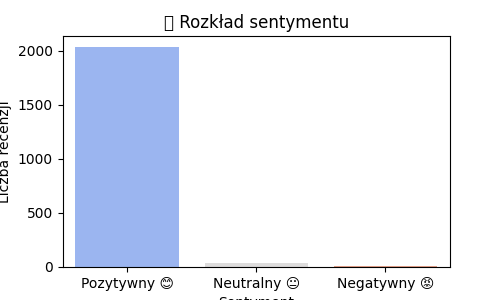
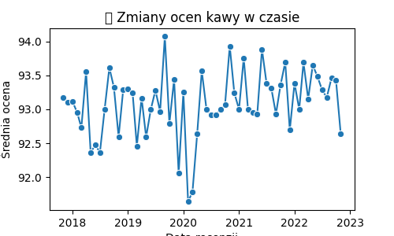
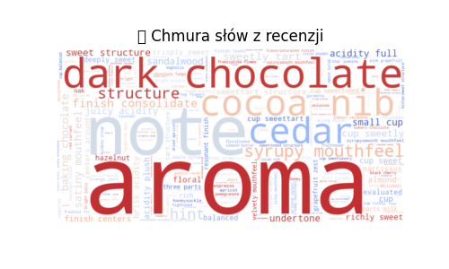

# ☕ Coffee Reviews Analysis

📊 **Analiza recenzji kawy** – projekt wykorzystujący **analizę sentymentu, NLP oraz wizualizacje danych** do lepszego zrozumienia opinii klientów na temat różnych kaw.

---

## 📌 **Spis treści**
1. [Opis projektu](#opis-projektu)
2. [Użyte technologie](#użyte-technologie)
3. [Struktura plików](#struktura-plików)
4. [Jak uruchomić projekt](#jak-uruchomić-projekt)
5. [Przykłady wizualizacji](#przykłady-wizualizacji)
6. [Wnioski](#wnioski)
7. [Kontakt](#kontakt)

---

## 📌 **Opis projektu**
Celem projektu jest **analiza recenzji kawy** pod kątem sentymentu i identyfikacji kluczowych tematów.  
Wykorzystaliśmy **przetwarzanie języka naturalnego (NLP), analizę sentymentu oraz modele uczenia maszynowego**, aby zrozumieć, co wpływa na pozytywne lub negatywne opinie klientów.

**Główne cele projektu:**
- 📈 **Zrozumienie, jak klienci oceniają kawę**  
- 🔍 **Analiza sentymentu** (pozytywne, neutralne, negatywne opinie)  
- 🏷 **Identyfikacja kluczowych tematów** w recenzjach  
- 📊 **Wizualizacja wyników** w interaktywnym dashboardzie  

---

## 🛠 **Użyte technologie**
✅ **Język programowania:** Python  
✅ **Biblioteki:** Pandas, NumPy, Scikit-learn, NLTK, Matplotlib, Seaborn, WordCloud  
✅ **Analiza NLP:** Tokenizacja, stemming, lematyzacja  
✅ **Wizualizacje:** Matplotlib, Seaborn, WordCloud  
✅ **Dashboard:** Streamlit  

---

## 📂 **Struktura plików**
📄 **`Coffee_Reviews_Analysis.py`** – główny skrypt analizy  
📊 **`dashboard.py`** – interaktywny dashboard w Streamlit  
📄 **`generate_report.py`** – generowanie raportu PDF  
📂 **`data/`** – pliki CSV z recenzjami  
📄 **`README.md`** – dokumentacja  

---

## 🚀 **Jak uruchomić projekt?**
### 🔹 1. Klonowanie repozytorium  
```bash
git clone https://github.com/Znev434/Coffee_Reviews_Analysis.git
cd Coffee_Reviews_Analysis
```
### 🔹 2. Instalacja bibliotek  
```bash
python -m venv venv
source venv/bin/activate  # (Linux/macOS)
venv\Scripts\activate     # (Windows)
pip install -r requirements.txt
```
### 🔹 3. Uruchomienie analizy  
```bash
python Coffee_Reviews_Analysis.py
```
### 🔹 4. Uruchomienie dashboardu  
```bash
streamlit run dashboard.py
```

---

## 📊 **Przykłady wizualizacji**  
🔹 **Sentyment recenzji:**  


🔹 **Zmiany ocen w czasie:**  
  

🔹 **Najczęściej używane słowa:**  


---

## 📌 **Wnioski**
📌 **Co odkryliśmy?**  
- Pozytywne recenzje koncentrują się na **smaku, aromacie i jakości kawy**  
- Negatywne recenzje dotyczą głównie **ceny, opakowania i dostawy**  
- Analiza sentymentu pozwala na **lepsze zrozumienie opinii klientów**  
- Dashboard pozwala na **interaktywne eksplorowanie danych**  

---

## 📩 **Kontakt**
👤 **Autor:** Michał Wenz  
🔗 **GitHub:** [profil GitHub](https://github.com/Znev434)  
 

---

🎯 **Ten projekt pokazuje moje umiejętności w analizie danych, NLP i wizualizacji! 🚀**

